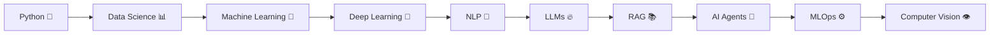

<div align="center">


<br>


</div>


# 👋 About Me

Hi, I'm **Eid Ahmed** 🚀

🎓 Data Science & Artificial Intelligence Student  
🤖 AI Engineer passionate about designing intelligent systems  
🏆 First Place Hackathon Winner with **Team GoAI**

I enjoy transforming ideas into AI-powered solutions using data, machine learning models, and modern AI technologies.

My main interests:

- 🤖 Artificial Intelligence
- 🧠 Machine Learning & Deep Learning
- 📝 Natural Language Processing (NLP)
- 🔥 Generative AI
- 📚 LLM Applications
- 🔎 RAG Systems
- ⚙️ MLOps
- 👁️ Computer Vision (Future Focus)


---

# 🏆 Achievements


<div align="center">

## 🥇 First Place Hackathon Winner

### Team: GOAI

</div>


## 🚚 GoAI - Smart Delivery Platform for Gaza

A digital delivery ecosystem designed to solve transportation and delivery challenges in Gaza.

The application provides:

🚲 Bicycle delivery system  
🚗 Car delivery system  
🏪 Marketplace connecting stores and customers  
📦 Delivery management solutions  

The goal was to create a practical platform that supports local businesses and improves delivery accessibility.


---

# 🌍 Global Hackathon Participation


<div align="center">

## Team: GOAI

</div>


# 🧠 MentalLoad

An AI-powered system designed to measure and reduce mental fatigue caused by intensive usage of AI tools.

The system analyzes:

📝 User answers  
💬 Free-text input  
📊 Fatigue level estimation  
🤖 AI recommendations  
🔮 Next-day workload prediction  


The goal is to help users build healthier interaction patterns with AI systems.


---

# 🛠️ Tech Stack


<div align="center">


<br><br>


</div>


---

# 📊 Data Science & Machine Learning

```
Python
Pandas
NumPy
Scikit-Learn
Matplotlib
Seaborn
Feature Engineering
Data Analysis
Machine Learning Algorithms
Model Evaluation
Predictive Modeling
```


---

# 🧠 Deep Learning

```
Neural Networks
Deep Learning Fundamentals
Model Training
Model Optimization
PyTorch
TensorFlow
Computer Vision (Learning)
```


---

# 🤖 Generative AI & LLM Stack


```
Large Language Models (LLMs)

RAG

AI Agents

LangChain

Vector Databases

ChromaDB

FAISS

Hugging Face

Prompt Engineering

OpenAI API
```


---

# ⚙️ MLOps & Deployment


Currently learning:

```
FastAPI

Docker

MLflow

CI/CD

Model Deployment

Production ML Systems

Cloud AI Deployment
```


---

# 🚀 AI Learning Roadmap





---

# 📌 Featured Projects


<table>

<tr>

<td width="50%">

<h3 align="center">🚚 GoAI Delivery</h3>

<p align="center">

AI-powered delivery ecosystem for Gaza

</p>

</td>


<td width="50%">

<h3 align="center">🧠 MentalLoad</h3>

<p align="center">

AI mental fatigue analysis and recommendation system

</p>

</td>

</tr>

</table>


---

# 📈 GitHub Statistics


<div align="center">


</div>


---

# 🐍 Contribution Snake


<div align="center">


</div>


---

# 📫 Connect With Me


📧 Email:
your-eidez1252002@gmail.com


💼 LinkedIn:
https://www.linkedin.com/in/eidahmed-ai-engineer/


---

<div align="center">

⭐ Building AI solutions from ideas to reality.

</div>
